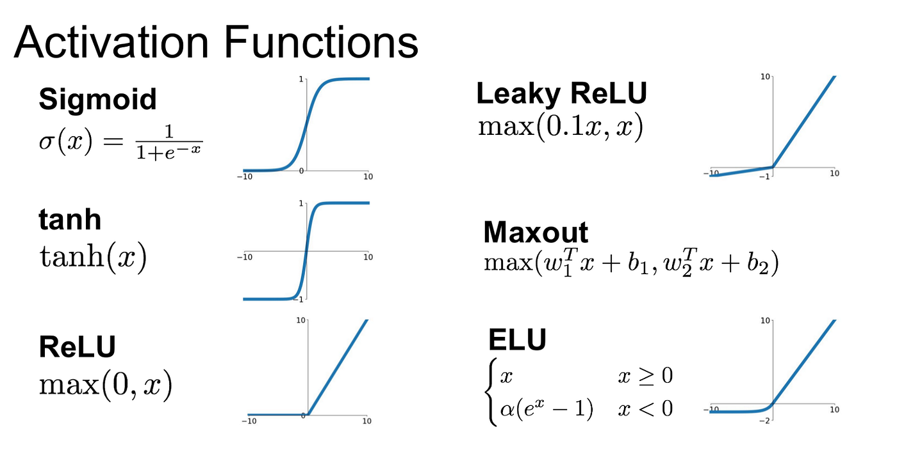

# Multilayer Perceptron (from scratch)

A perceptron is a fundamental component of artificial neural networks. Inspired by the neurons in our brains*, these perceptrons make decisions and "learn" by iterating to minimize errors. When these single perceptrons are combined in layers, they form networks that can "learn" more complex patterns and make more nuanced decisions.

**Organic neurons can have different purposes, and more neurons do not necessarily mean more intelligence. I think this is really interesting because this is very similar to how artificial neurons work.*
   ***Fun Fact:** The African elephant brain has 257 billion neurons which is 3x the human brain. - https://pmc.ncbi.nlm.nih.gov/articles/PMC4053853/*
  
In an attempt to grasp these mechanisms more thoroughly, I decided to create my own simple multilayer perceptron (MLP) and compute everything by hand (using a calculator). This process gave me a more confident and comprehensive understanding of this concept, which I can lean on when dealing with more complex systems. This process also helped to demystify AI and has given me a greater appreciation for the computing power of modern computers.

## Full Notebook

## Architecture
When building an MLP, one of the first decisions that has to be made is the architecture. In other words, how many layers of perceptrons, how many perceptrons in each layer, and the connections between the perceptrons. Since I am doing all these calculations manually, I wanted to keep the architecture simple. Here I have what looks like a fully connected 3-layer network, but is functionally just 2 computational layers, given that the input layer doesn't contain any parameters, just passes the inputs to the next layer. The hidden layer learns the patterns in the data and passes its own version of input information to the output layer, which has the responsibility of making the prediction. In a deeper network, the first hidden layers learn more surface-level patterns while the deeper layers learn the complex and specific patterns in the data. 

The learning process that was mentioned earlier involves updating parameters (weights and biases) to minimize loss. These parameters were randomly chosen values between 0 and 1, again to make calculations easier.

## 1st Forward Pass
### Step 1: Compute weighted sum
The first forward pass will yield the first prediction, which will start the learning process. Here in step 1, you calculate the hidden neurons by multiplying the inputs by the weights that connect those inputs to the hidden neuron and then adding the bias associated with the hidden neuron. The weights are used to distribute the importance of certain inputs to the neuron. This is useful, for example, if you are trying to find the difference between a tulip and a rose, one hidden neuron could roughly be responsible for detecting color, and another neuron could focus on the petal shape. If the inputs are the RGB values and petal length and width, then RGB should account for more decision-making power in hidden neuron 1, and length and width should account for more in hidden neuron 2. The weights will make those distributions accordingly. The biases are also useful for setting the baseline for each neuron. If you have data that has 0's as inputs without biases, that would break the model. A bias ensures the model will function regardless of the training data and allows the model to fit data that doesn't intersect the origin.

### Step 2: Pass weighted sum through activation function to introduce non-linearity
A key part of an MLP is the activation function. Without an activation function, the model could be reduced to a single equation and would behave more like linear regression. For example, this whole network could be collapsed into this one equation: (0.5(0.4) + 0.8(0.3) + 0.1)0.5 + (0.5(0.2) + 0.8(0.6) + 0.1)0.7 + 0.1. Instead, adding an activation function introduces non-linearity and makes the network impossible to reduce to a single linear equation. A simple and common activation function that is used in hidden layers is ReLU, which sets any negative number to 0 and retains the value of positive numbers. I chose sigmoid here because it works for both hidden and output layers and is straightforward to differentiate during backpropagation, which will be helpful in the next section.

*https://medium.com/@krishnakalyan3/introduction-to-exponential-linear-unit-d3e2904b366c*

### Step 3: Compute weighted sum for next layer
This step mirrors step 1, except the outputs of the hidden layer now serve as the inputs. This layered structure helps to learn complex patterns because the layers feed into each other and use the previous layers' "knowledge" to inform decisions.

### Step 4: Pass weighted sum into activation function
Here, the same process detailed in step 2 is used to compress the output into a probability between 0 and 1. Since this layer is an output layer, the activation function choice is a little more constrained than for a hidden layer. For this example, our model is a binary classifier (0 or 1). Therefore, the activation function needs to compress the output between 0 and 1. If this were a multi-class classification problem, then a softmax function would be a better choice.

### Step 5: Calculate Loss
Finally, the loss is calculated to determine how well the model is performing. There are different ways to calculate loss, but for this example, I used mean squared error (MSE), which is calculated by squaring the difference between the prediction and the label. With only a single example, there is nothing to average, so this simplifies to plain squared error. However, with multiple examples, the mean would be taken across all of them. It is worth noting that the scalar loss value itself doesn't appear in the weight update equations, but instead, the gradient of the loss is what drives learning. The loss value is better used as a benchmark to track progress across training iterations. While it may seem like a loss of 0 is the gold standard, that is not necessarily true. A loss of 0 would imply that the model is too specifically fit to the training set and would not perform as well on unseen data. Instead, it is best if the model minimizes loss while still being general enough to work on new data. This is important to note, but generalization is beyond the scope of this project.

## Backpropagation
### Step 1: Differentiate loss function
Now the learning process begins, and the model can start to make adjustments based on the loss. This is the first step in the process, called backpropagation, and basically just goes backward through the model. The loss value calculated in the previous step states how wrong the model is, but it does not possess information on how wrong each individual parameter was. That is where differentiation comes in. The derivative of a function represents its rate of change, which can be used to determine which direction to push the parameters and by how much. Here, the function being differentiated is MSE, which, after applying the differentiation, equates to 2(predicted - actual). 

### Step 2: Differentiate the activation function
The next step in backpropagation is to differentiate the activation function. The derivative measures how sensitive each neuron's output was to changes in its input at the exact point it fired. Activation functions are meant to scale the inputs, which distorts the input signal. This signal needs to be retrieved to ensure that each weight is adjusted proportionally to its contribution to the loss.

### Step 3: Compute output delta (Step 1 x Step 2)
The output delta is the differentiated loss value from step 1, multiplied by the differentiated activation function from step 2. The loss value needs to pass backward through the activation function in order to continue on to the parameters. This is where the output delta comes in. This value combines the 2 differentiated functions, effectively translating the loss gradient from output space into pre-activation space.

### Step 4: Calculate Output Gradients
Here, the gradient that will be used to update the output weights is calculated. This calculation scales the output delta from the previous step by the input to see how much blame should be put on each of the weights. If the inputs or gradients are too small, then the weights will barely update. It is also important to note that the inputs in this step are the outputs from the hidden layer and not the original inputs. 

### Step 5: Calculate hidden neuron deltas
Similar to step 3, the delta is composed of the loss signal and the derivative of the activation function. Here, the loss signal is represented by the output delta, which is scaled by the output layer weights to pass the blame proportionally to the hidden layer. Then the derivative of the activation function is taken. Here is where the sigmoid function works really well. As I mentioned in the 1st forward pass step 2, the sigmoid function makes it relatively simple to get its derivative. All you need is its own output, which is multiplied by its complement. Then the scaled delta is combined with the derivative of the activation function to get the hidden neuron deltas.

### Step 6: Calculate hidden weight gradients
Once the hidden neuron deltas are calculated, they are scaled by the hidden weight inputs to get the gradients, which express how much each of the weights should change.

### Step 7: Update Weights
Now we can finally update the weights using the old weight, learning rate, and gradient. The learning rate is used to determine how much the new weights should change. Too small a learning rate and the updates will take too long to converge on an optimal answer. Too large a learning rate and the updates will bounce around and may never settle on effective parameter values. Larger learning rates can also pass over more optimal values by over-adjusting. There are lots of strategies for choosing a learning rate, but for this example, 0.1 will work.

Calculating the biases is a little different from calculating the weights. Since bias is added and not multiplied by the inputs, it does not require a gradient in the same way the weights do. Instead, the bias essentially has a weight = bias and an input = 1. Therefore, the gradient would be delta x 1, which is just the delta. So to calculate the new biases, you would use the delta values as the gradient. 

## 2nd Forward Pass
### Step 1: Compute weighted sum
Once the new parameters are calculated from backpropagation, they can be substituted for the old weights, and then another forward pass can begin. 

### Step 2: Pass weighted sum through activation function to introduce non-linearity
Here we can see the marginal changes that the new weights bring. If the learning rate were higher, the changes would be more noticeable.

### Step 3: Compute weighted sum for next layer

### Step 4: Pass weighted sum into activation function

### Step 5: Calculate loss

### Step 6: Calculate change in loss
Now that the second forward pass is complete, we can see how much the model "learned" from the 1st forward pass. This is where the loss value comes in handy because it acts as a benchmark. Here, the loss did improve by 0.0027835127. This is a good sign and means the model improved from the 1st to the 2nd iteration.

This MLP is small and only uses one training example, but you can get a sense of what is going on and how many calculations are made for any modern applications. A 3x3x3x1 MLP with 1,000 training examples and 100 iterations would be over 14 million calculations for only 28 parameters! And that is still a relatively small network. GPT-5 is reportedly estimated to have between 2 and 5 trillion parameters and is trained on hundreds of billions of training examples. While GPT-5 is architecturally much more complicated than a simple 4-layer MLP, the idea is still the same. The computational power needed for such a task is immense. For me, this project has helped demystify these networks while increasing mystification on the massive scale at which models are trained.

---

© Caden Lippie 2026. Licensed under [Creative Commons Attribution 4.0 International](https://creativecommons.org/licenses/by/4.0/).
