# Multilayer Perceptron (from scratch)

A perceptron is a fundamental component of artificial neural networks. Inspired by the neurons in our brains*, these perceptrons make decisions and "learn" by iterating to minimize errors. When these single perceptrons are combined in layers, they form networks that can "learn" more complex patterns and make more nuanced decisions.

**Organic neurons can have different purposes, and more neurons do not necessarily mean more intelligence. I think this is really interesting because this is very similar to how artificial neurons work.*
   ***Fun Fact:** The African elephant brain has 257 billion neurons which is 3x the human brain. - https://pmc.ncbi.nlm.nih.gov/articles/PMC4053853/*
  
In an attempt to grasp these mechanisms more thoroughly, I decided to create my own simple multilayer perceptron and compute everything by hand (using a calculator). This process gave me a more confident and comprehensive understanding of this concept, which I can lean on when dealing with more complex systems. This process also helped to demystify AI and has given me a greater appreciation for the computing power of modern computers.

## Full Notebook
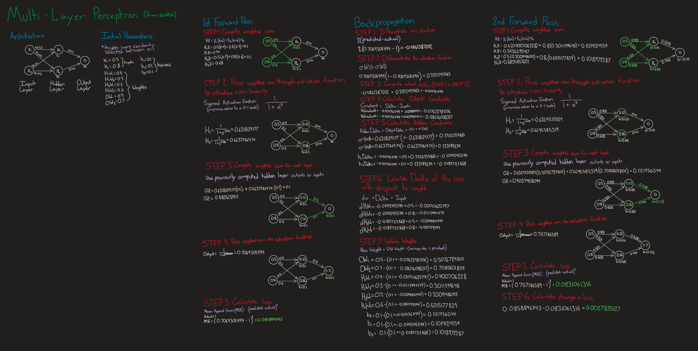

## Architecture
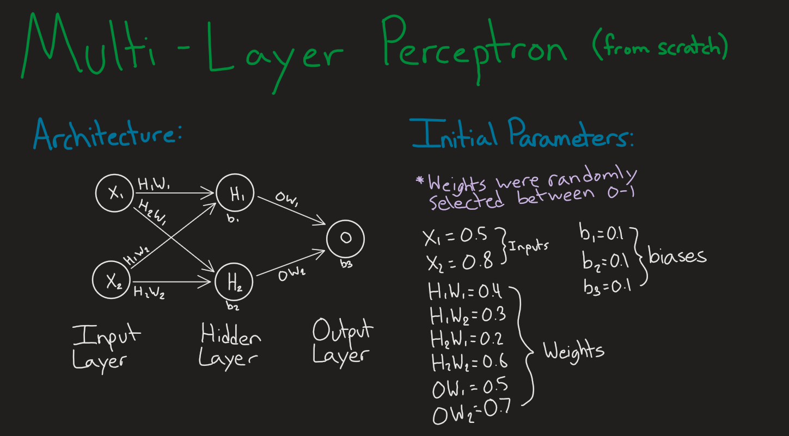

## 1st Forward Pass
### Step 1: Compute weighted sum
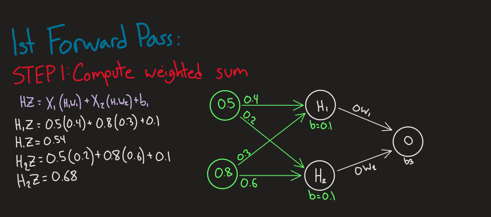

### Step 2: Pass weighted sum through activation function to introduce non-linearity
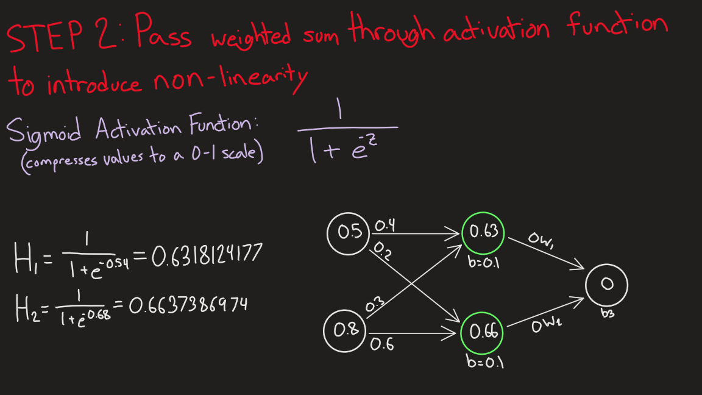

### Step 3: Compute weighted sum for next layer
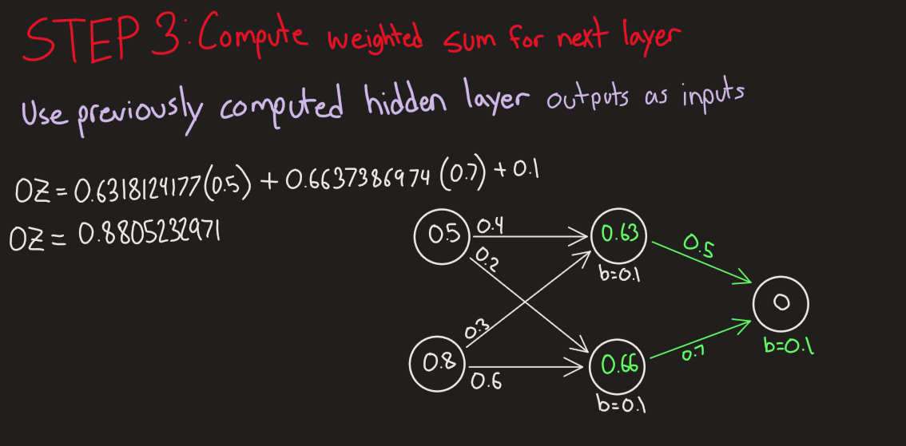

### Step 4: Pass weighted sum into activation function
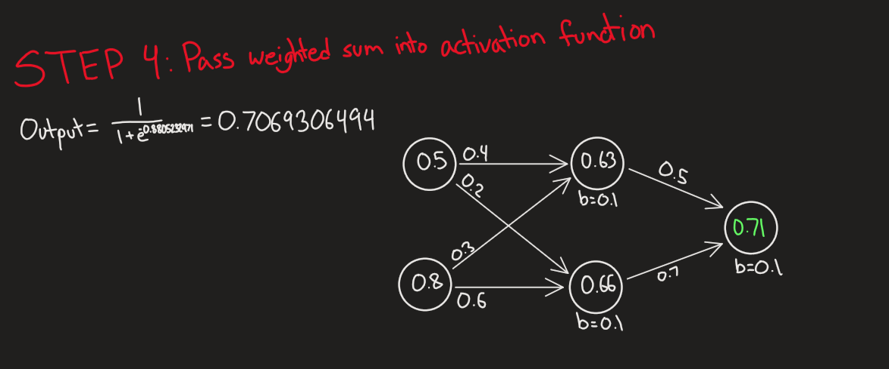

### Step 5: Calculate Loss
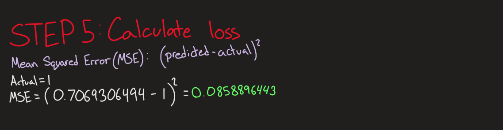

## Backpropagation
### Step 1: Differentiate loss function
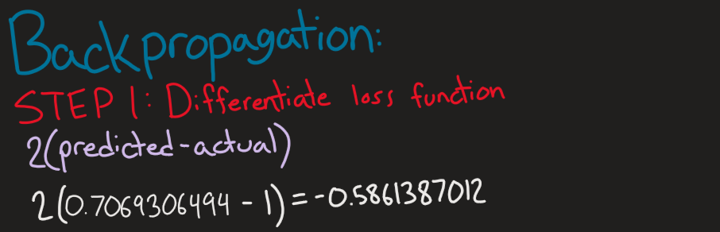

### Step 2: Differentiate the activation function
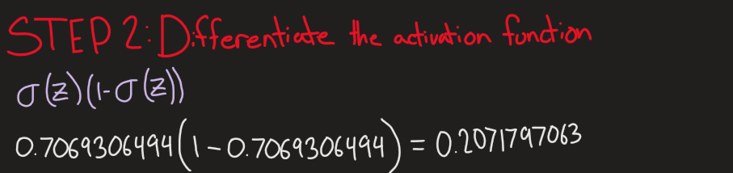

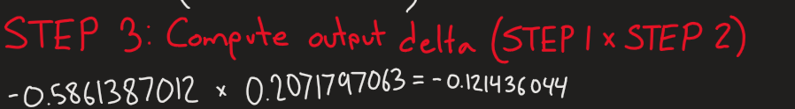

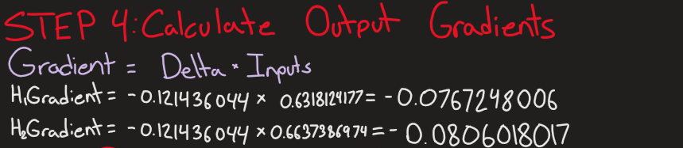

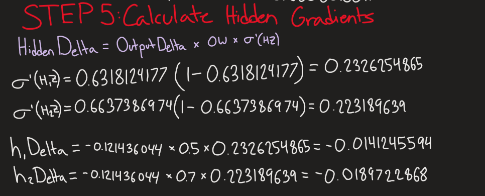

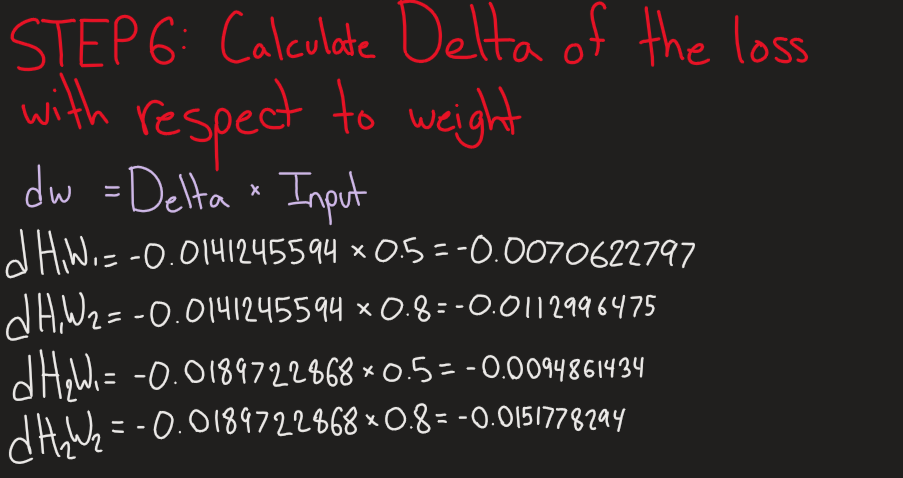

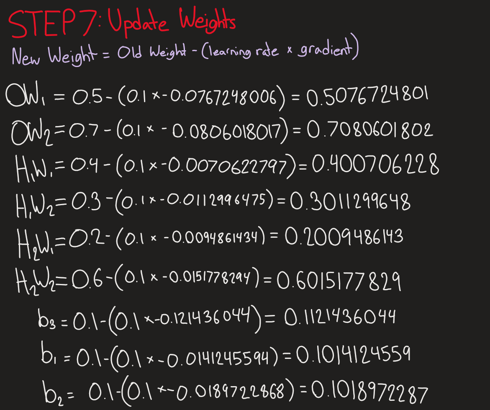

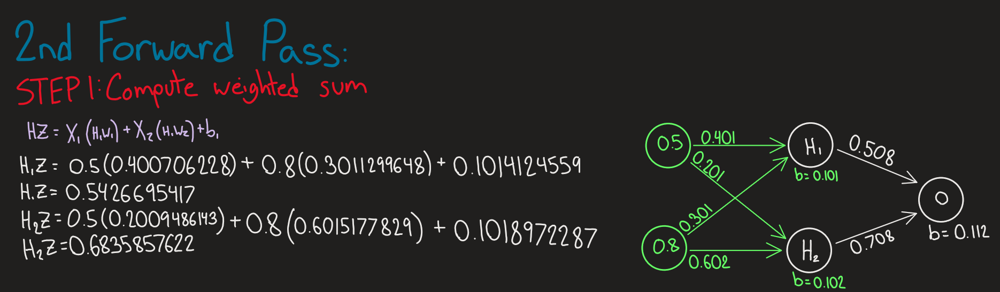

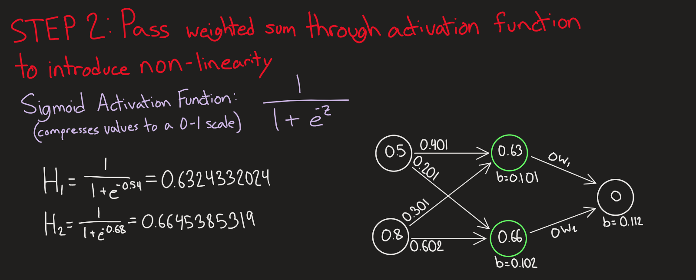

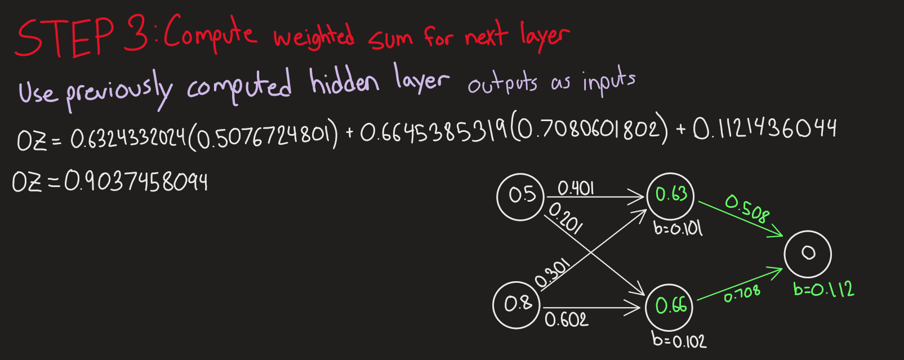

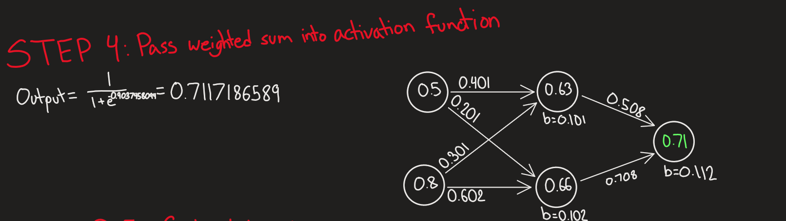

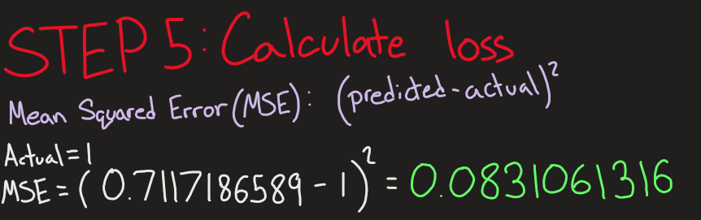

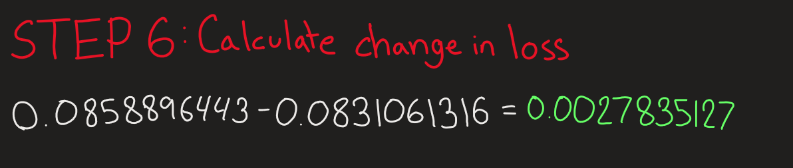
